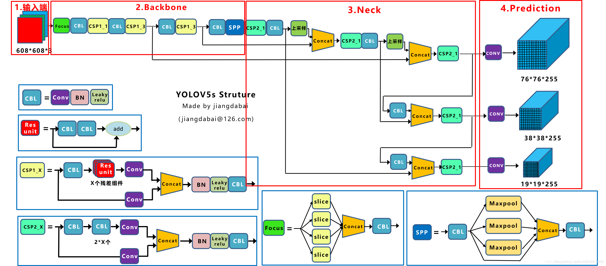

# **智能眼底影像分析**

[原始数据集](https://drive.google.com/drive/folders/1H1xD5riEKEmm_riY_nZoa4Yesi6OS7Rv?usp=sharing)、[模型权重](https://drive.google.com/drive/folders/1cdNCKqMRbC4SzH3-bI2en9IaWtvmGPO2?usp=sharing)

## 任务一：中心凹检测定位

### 模型简述

   在此任务中我们选择了以YOLOv5模型为基础进行眼底图像中心凹的定位检测。YOLO模型发展到最新的第五代已经算是一个非常成熟的体系了，相关的数据预处理、预训练权重、调参流程和结果可视化都做得比较完备了，这也是我们选择使用它进行目标检测任务的一个原因。

另外一点原因则是由于项目本身的特性。我们观察原始数据集后不难看出，每幅图像只有一个检测目标，并且标定框的尺寸相对于整幅图片来说也不是很小，因此即使是使用单阶段检测方法也能获得不错的效果，此外我们也考虑过使用基于注意力机制的端到端检测方法，但是由于标定数据集较少我们最终还是决定使用YOLOv5进行训练。



YOLOv5在第三代和第四代的基础上做出了一些调整。在输入端除了保留Mosaic数据增强方法、它还增加了自适应锚框计算、自适应图片缩放等功能。backbone方面，v5在输入端后的降采样方式更新为Focus模块并且调整了CSP的内部结构。在neck层级中保留了v4的融合多尺度特征图的方式。

### 训练流程

#### 数据准备：（[这是处理好的数据集](https://drive.google.com/drive/folders/1KVLMk71KkgyeYAE99oK1pT_zcdwYFJjD?usp=sharing)）

我们拿到手的任务数据集内容是八十张眼底图像和对应的边界框标签数据。

```html
中心凹检测
|---train（图片）
|---train_location（标签）
|---fovea_localization_train_GT.csv（框中心坐标）
```

为了将数据转换成YOLO对应的格式，我们参考了YOLOv5项目内提供的方法：在 [Roboflow](https://roboflow.com/?ref=ultralytics) 网站上传图片和相应的标签文件即可生成YOLO可用的数据集，并且还可以选择进行图像预处理和数据增强。除了自定义的数据集，YOLOv5还有五种规模的网络和预训练权重可供选择，我们选用的是YOLOv5m。

#### 模型训练：

首先要把项目克隆到本地，然后配置相应环境。这里我们选择在本地跑通调试好再上传到服务器进行训练，如果设备中已经有部分所需的环境（pytorch，torch vision等）则最好根据需求列表手动安装，否则可能会产生一些版本覆盖情况发生，最终导致相关的库之间版本不匹配。

在服务器端则可以直接运行下述命令行指令：

```cmd
git clone https://github.com/ultralytics/yolov5  # clone
cd yolov5
pip install -r requirements.txt  # install
```

配置好环境后要进行相关路径设置，为了不改动源项目，我们在这的操作都是先复制副本，再在副本上进行修改。

```
本地项目的文件目录部分内容如下（下载的处理好的数据集要放在此文件夹中）：
yolov5_for_detection
|---models
    |---yolov5m.yaml
|---data
|---datasets_for_yolov5
    |---fovea_data.yaml
|---runs
|---train.py
|---detect.py
|---yolov5m.pt
```

首先复制一份yolov5m.yaml的模型描述文件，重命名为fovea.yaml。进入文件后修改分类数即可（想修改anchor尺寸也可以，但是对效果提升没什么帮助）。如果是编译器中运行那么要在train文件修改参数，或者也可以直接命令行运行下面的指令。

模型运行时所保存的数据和权重都在runs文件夹下，也可以通过tensorboard实时查看可视化的训练过程。

```cmd
python train.py --data datasets_for_yolov5/fovea_data.yaml --cfg models/fovea.yaml --weights yolov5m.pt --epochs 100 --batch-size 16
TensorBoard: Start with 'tensorboard --logdir runs\train', view at http://localhost:6006/
```

### 实验和结果分析


## 任务二：血管分割

### 模型简述


### 训练流程

[数据集](https://drive.google.com/drive/folders/16Usia2gUBUzLglrNI2edM5iJaclvrZrj?usp=sharing)

### 实验和结果分析


## 任务三：糖尿病视网膜病变分级

### 模型简述


### 训练流程

[数据集](https://drive.google.com/drive/folders/1T54Cn1Y98KO_SauicJ22tQQ20ZGFlTK3?usp=sharing)

### 实验和结果分析

------

### 参考项目：

- https://github.com/ultralytics/yolov5.git

- https://github.com/WZMIAOMIAO/deep-learning-for-image-processing.git
